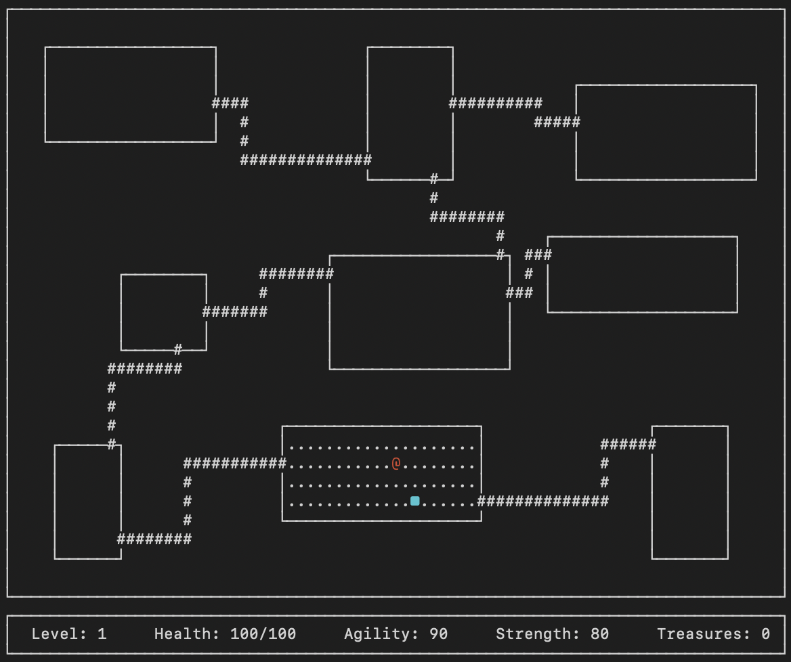

## ROGUELIKE

## Реализация классической игры Rogue 1980 года на языке программирования Java в консольным представлении с использованием библиотеки Lanterna 

## Описание игры
Основной темой игры является исследование подземелий. Игрок выполняет роль искателя приключений.\
Игра начинается на самом верхнем этаже подземелья с большим количеством монстров и сокровищ. Каждый этаж состоит из 9 комнат, соединённых коридорами, и представляет собой сетку 3х3
\
По мере продвижения вглубь подземелья, возрастает количество и сила монстров, а продвижение усложняется.\
Цель игрока — найти на каждом уровне переход на следующий уровень и, таким образом, пройти всю игру (21 уровень). С каждым новым уровнем повышается количество и сложность противников, снижается количество полезных предметов и повышается количество сокровищ, которые выпадают с побежденных противников.

## Технические особенности:
Приложение реализовано на языке Java версии 21 и имеет консольный интерфейс на базе библиотеки Lanterna.\
Логика приложения разделена на:
- Слой представления:
    - Рендеринг среды — стены, пол, коридоры
    - Рендеринг акторов — персонаж, противники, подбираемые предметы
    - Рендеринг интерфейса — панель статуса, инвентаря, простое меню
    - Туман войны — неизведанные комнаты и коридоры не отображаются, просмотренные комнаты, в которых не находится игрок, отображаются только как стены. При нахождении в непосредственной близости с комнатой со стороны коридора туман войны рассеивается только на области прямой видимости
- Слой бизнес-логики:
    - Игровая сессия
    - Уровни и комнаты
    - Главный герой и противники
    - Инвентарь (рюкзак и предметы)
- Слой доступа к данным:
    - Статистика (пункт 3  в главном меню)
    - Загрузка предыдущей сессии (пункт 2  в главном меню)

## Логика игры
Игра состоит из 21 уровня. Каждый уровень подземелья состоит из 9 комнат, соединённых коридорами. Из любой комнаты по этим коридорам можно попасть в любую другую.\
В каждой комнате могут находиться противники и предметы, за исключением стартовой комнаты. Вся игра работет в пошаговом режиме: каждое действие игрока запускает действия противников.\
Игрок управляет перемещением персонажа и может взаимодействовать с предметами или сражаться с противниками. Еда, эликсиры, свитки при использовании тратятся. Оружие при смене падает на пол на соседнюю клетку.\
После каждого прохождения результат игрока фиксируется в таблицу рекордов (пункт 3  в главном меню), где указывается достигнутый уровень подземелья и количество собранных сокровищ.\
5 видов противников:
- Зомби (зелёная `z`): низкая ловкость, средние сила и враждебность, высокое здоровье
- Вампир (красная `v`): высокие ловкость, враждебность и здоровье, средняя сила. Первый удар по вампиру — всегда промах
- Привидение (белая `g`): высокая ловкость, низкие сила, враждебность и здоровье. Постоянно телепортируется по комнате и периодически становится невидимым, пока игрок не вступил в бой
- Огр (желтая `O`): ходит по комнате на две клетки. Очень высокие сила и здоровье, но после каждой атаки отдыхает один ход, затем гарантированно контратакует, низкая ловкость, средняя враждебность
- Змей-маг (обелая `s`): очень высокая ловкость. Ходит по карте по диагонали, постоянно меняя сторону. У каждой успешной атаки есть вероятность «усыпить» игрока на один ход. Высокая враждебность

Типы предметов:
- сокровища (имеют стоимость, накапливаются и влияют на итоговый рейтинг, можно получить только при победе над монстром)
- еда (восстанавливает здоровье на некоторую величину)
- эликсиры (временно повышают одну из характеристик: ловкость, силу, максимальное здоровье)
- свитки (постоянно повышают одну из характеристик: ловкость, силу, максимальное здоровье)
- оружие (имеют характеристику силы, при использовании оружия меняется формула вычисления наносимого урона)

## Логика боя
\
Инициация боя происходит при контакте с врагом. Бой вычисляется в пошаговом режиме.\
Атака производится путем перемещения персонажа по направлению к противнику.\
Удары просчитываются по очереди, в несколько этапов:
- 1 этап — проверка на попадание. Проверка на попадание случайна и высчитывается из ловкости бьющего и цели удара
- 2 этап — расчет урона. Рассчитывается из силы и модификаторов
- 3 этап — применение урона. Урон вычитается из здоровья. Если здоровье падает до 0 или ниже, то противник или персонаж погибает

Из каждого противника при победе выпадает случайное количество сокровищ, зависящее от враждебности, силы, ловкости и здоровья противника.

## Управление
Управление осуществляется с помощью клавиатуры:\
`WASD` — перемещение\
`H` — использовать оружие из рюкзака\
`J` — использовать еду из рюкзака\
`K` — использовать эликсир из рюкзака\
`Z` — использовать свиток из рюкзака\
`ESCAPE` - выход из игры и сохранение сессии\
При использовании предмета показывается список, в котором нужно выбрать конкретный предмет

## Сборка и запуск
Для сборки и запуска требуются Java JDK 17 или выше и сборщик Gradle.\
Сборка:
```
cd src/roguelike
./gradlew release
```
Запуск:
```
java -jar build/libs/roguelike-all.jar
Или двойным кликом на файл `build/libs/roguelike-all.jar` в проводнике
```
**Если при сборке получаете ошибку `Could not find or load main class org.gradle.wrapper.GradleWrapperMain`:**

Это означает, что `gradle-wrapper.jar` поврежден. Исправьте это:

```
chmod +x fix-gradle-wrapper.sh
./fix-gradle-wrapper.sh